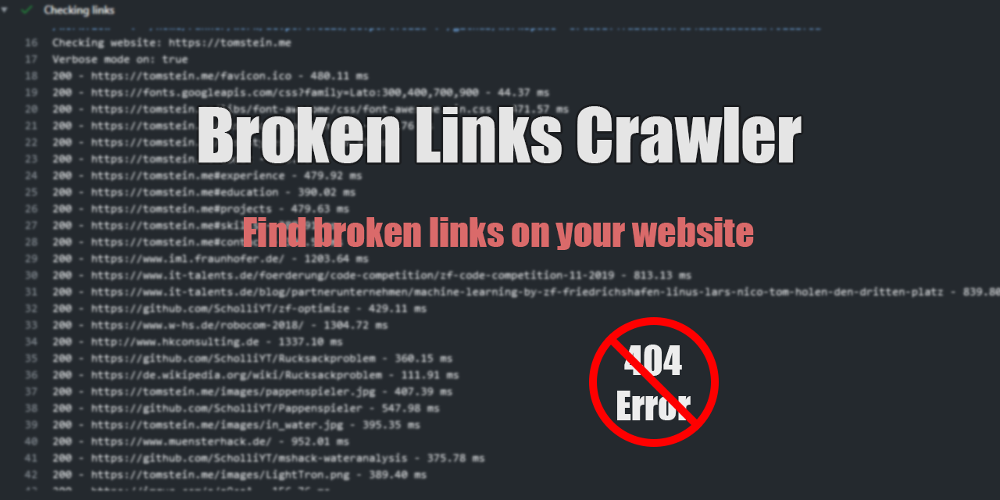

# Broken-Links-Crawler-Action
This action checks all links on a website. It will detect broken links i.e. links that return HTTP Code 403, 404...
Check the logs to see which links are broken and consequently cause this action to fail. 

Based on this work: https://github.com/healeycodes/Broken-Link-Crawler  
**Demo: https://github.com/ScholliYT/devportfolio/actions?query=workflow%3A%22Site+Reliability%22**
## Inputs

### `website_url`

**Required** The url of the website to check.

### `exclude_url_prefix`

**Optional** Comma separated list of url prefixes to exclude. Some sites do not respond properly to bots and you might want to exclude those known sites to prevent a failed build.

### `verbose`

**Optional** Turn verbose mode on/off (default false).

### `max_retry_time`

**Optional** Maximum time for request retries (default 30).

### `max_retries`

**Optional** Maximum request retry count (default 4).

## Outputs

## Example usage
```yml
uses: ScholliYT/Broken-Links-Crawler-Action@v2.1.1
with:
  website_url: 'https://github.com/ScholliYT/Broken-Links-Crawler-Action'
  exclude_url_prefix: 'mailto:,https://www.linkedin.com,https://linkedin.com'
  verbose: 'true'
  max_retry_time: 30
  max_retries: 5
```

## Dev

The easiest way to run this action locally is to use Docker. Just build a new image and pass the correct env. variables to it. 
```
docker build --tag broken-links-crawler-action:latest .
docker run -e INPUT_WEBSITE_URL="https://github.com/ScholliYT/Broken-Links-Crawler-Action" -e INPUT_VERBOSE="true" -e INPUT_MAX_RETRY_TIME=30 -e INPUT_MAX_RETRIES=5 -e INPUT_EXCLUDE_URL_PREFIX="mailto:,https://www.linkedin.com,https://linkedin.com" broken-links-crawler-action:latest
```
### Automated Testing

You can run the full suite of automated tests on your local machine by using the "act" tool to simulate the github workflow action that executs during commit, more information here:  
https://github.com/nektos/act

